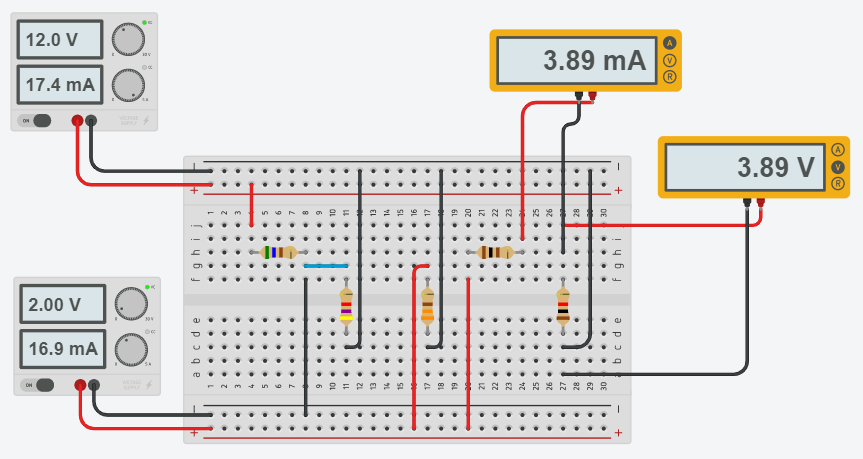

# Informe de laboratorio N°5

**Integrantes:**

Christian Bonifaz, Jean Jacome, Kevin Sandoval

**NRC:** 5406

**Docente:** Ing. Darwin Alulema

**Tema:** 

#### 1. OBJETIVOS 

• Analizar el Teorema de Thevenin y determinar un circuito equivalente en cualquier red resistiva.
• Comparar ambos circuitos para demostrar el teorema de Thevenin.
#### 2. MARCO TEÓRICO 

#### 3. EXPLICACIÓN DEL PROCEDIMIENTO

3.1 Materiales y Equipo requerido

3.2 Arme el circuito que se muestra

3.3 Mida el voltaje y la corriente en el resistor R5, anote los resultados en la tabla 3.2.

3.4 Desconecte el resistor R5 y mida el voltaje en el circuito abierto. Anote el valor medido en la tabla 3.1.

3.5 Anule el efecto de las fuentes de alimentación. Desconecte R5 y desde el circuito abierto resultante mida la resistencia equivalente. Anote el valor medido en la tabla 3.1.

3.6 Implemente el circuito equivalente de Thévenin, agregue el resistor R5 y mida la corriente y el voltaje en el mismo, anote los resultados en la tabla 3.2.

**Tabla 3.1**

**Tabla3.2**

#### 4. RESPUESTA A INTERROGANTES Y CALCULO DEL ERROR

Separamos el circuito de R5

Volvemos V=0 las fuentes del circuito

**Calculamos RTh**

**Calculamos VTh**

Sumamos las fuentes

Encontremos la corriente total

Calcularemos V3 mediante divisor de corriente

**Circuito Equivalente Thevenin**

Corriente  y Voltaje en R5

**Calculo del Error**

#### 5. VIDEO

#### 6. CONCLUSIONES 

• Se pudo obtener los resultados experimentalmente y teóricamente de los circuitos, a través del teorema de Thévenin

#### 7. BIBLIOGRAFÍA
